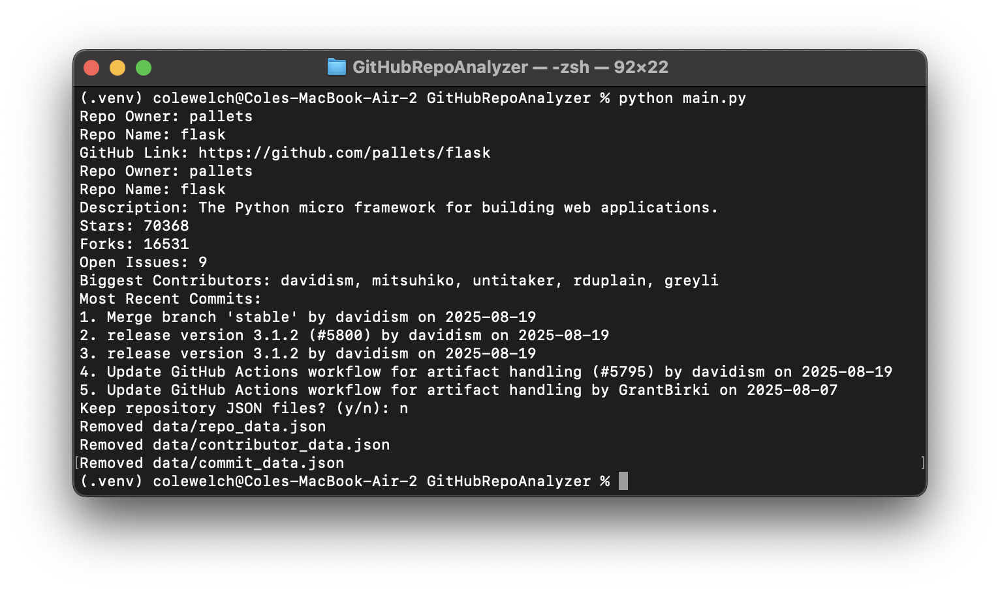

# GitHub Repository Analyzer

A Python tool that fetches and parses data from public GitHub repositories using the GitHub REST API. It retrieves:

- **Repository information**
- **Contributor statistics**
- **Recent commits**

The data is saved locally in JSON files and can be optionally removed after viewing.

---

## Features

- Fetch GitHub repo, contributor, and commit data
- Save API responses to JSON
- Parse and display readable summaries of the data
- Optionally delete JSON files after use
- Tested using `pytest`

---

## Example Output


---
# Setup

```bash
git clone https://github.com/cwelch2/GitHubRepoAnalyzer.git
cd GitHubRepoAnalyzer
python3 -m venv .venv      # macOS/Linux
python -m venv .venv       # Windows
source .venv/bin/activate  # macOS/Linux
.venv\Scripts\activate     # Windows
```


## Requirements

- Python 3.7+
- `requests` library
- `pytest` (for testing)


Install dependencies:
```bash
pip install -r requirements.txt
```

---

## How to Run

After setup and installing dependencies, you can run the program directly using:

   ```sh
   python main.py 
   ```


---

## Testing
This project uses `pytest` for testing.
### Run Tests
```bash
cd GitHubRepoAnalyzer #if not already in the project folder
pytest
```

